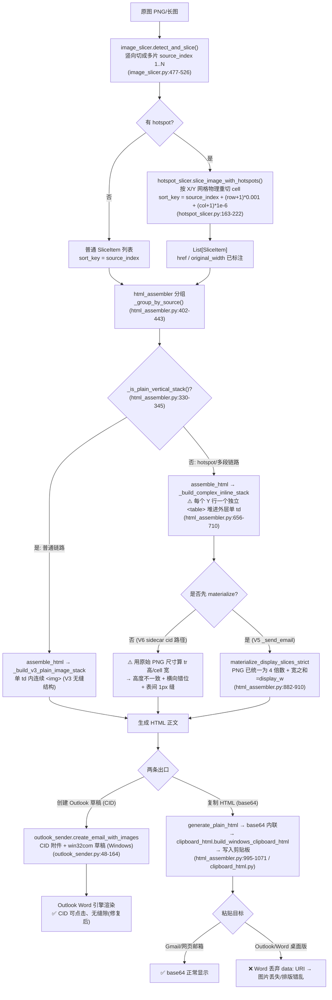

# Outlook 长图切片工具 —— 架构评审与修复方案设计

> 评审对象：`/Users/huashu/outlook-img-slicer`
> 角色：架构师（高见远）　|　范围：现有代码的**根因分析 + 修复方案设计**（不写新功能）
> 方法：所有结论均基于本人在下述 file:line 处**亲自阅读源码**确认的事实，未做凭空断言。
> 当前生效版本：`legacy/v5-python-ui/main.py` 为 6.0.3 生产入口（`HOTSPOT_FEATURE_ENABLED=True`）；`app/` 是 V6 React/Electron 重写（尚未接入 hotspot）；`sidecar/sidecar_server.py` 是其 Python 后端。

---

## 1. 架构与数据流总览

整条链路是**纯本地、离线**的：图片在本地被物理切割成 PNG 切片，HTML 仅做"顺序拼接 + CID 引用/ base64 内联"，最终由 Outlook COM 把 CID 附件贴进草稿（绝不自动发送）。hotspot（可点击按钮）是在物理切割阶段就把原图按 X/Y 网格切成独立 cell PNG，每个 cell 带 `href`，故"带按钮"与普通长图在**管线后半段（html_assembler）才分叉**——这正是两套 HTML 结构、两套 bug 的来源。



**核心分叉点小结**：普通链路走 `_build_v3_plain_image_stack`（单 td 连续 ``，V4.9.2 已修无缝）；hotspot 链路走 `_build_complex_inline_stack`（每 Y 行一个独立 `<table>`），**此函数未被 V4.9.2 的修复覆盖**，是问题 1 的载体。复制链路用 base64 内联（问题 2 载体）。

---

## 2. 问题 1：带按钮发送到 Outlook 出现"错位 / 缝隙"

### 2.1 根因确认（与您的判断一致，并补充精确证据）

**(a) 表间 1px 缝隙 —— `_build_complex_inline_stack` 每 Y 行生成一个独立 `<table>`**
- `html_assembler.py:669-709`：循环对每个 `group`（一个 Y 行）调用一次完整 `<table>…</table>` 拼接（694-709 行），再把所有 `<table>` 顺序累加进 `all_rows_html`，最后整体塞进 `assemble_html` 外层**单一 `<td>`**（957-982 行）或 `generate_plain_html` 的单一 `<td>`（1055-1064 行）。
- Outlook 的 Word 渲染引擎会在相邻的 block 级 `<table>` 之间插入约 1px 间距 → 这就是"加按钮后图片之间有缝"。
- 对比 V4.9.2 对**普通链路**的修复：普通链路走 `_build_v3_plain_image_stack`（`html_assembler.py:348-399`）+ 外层单 td（`assemble_html:957-982`），是 V3.0 验证过无缝的"单 td 内连续 ``"结构；但该修复**只改了普通链路**，`_is_plain_vertical_stack` 网关在 `assemble_html:928`、`generate_plain_html:1012` 把 hotspot/多段链路分流到了仍用 per-row `<table>` 的 `_build_complex_inline_stack`。**结论：hotspot 链路仍走旧结构，缝隙未修。**

**(b) 纵向错位 —— `<tr height>` 与 `<td>/` 高度不一致**
- `_build_complex_inline_stack` 里行高计算：`row_height = max(row_height, actual_h)`（`html_assembler.py:678`），此处 `actual_h` 是 `_get_img_dimensions` 读到的**原始像素**（**未 4 倍数化**）。该值被直接写进 `<tr height="{row_height}">`（`html_assembler.py:702`）。
- 而每个 cell 的高度由 `_build_cell` 内部 `_even_pixel_4x(round(actual_h * seg_display_w / actual_w))` 算出（`html_assembler.py:257-258`，`forced_display_h=None` 分支）——这是**缩放并 4 倍数化**后的值。
- 当切片**未经 materialize** 时：`actual_w/actual_h` 是原图尺寸（例如原宽 1000、原高 833、display_w=648），`_build_cell` 会把 cell 高度缩放到 `≈833×648/1000=539`（再 4 倍数化），而 `<tr height>` 仍是 **833**。两者差近 300px，Word 引擎按 `1px=0.75pt` 四舍五入后纵向比例失真、逐行累积漂移 → "错位"。

**(c) 横向错位 / 换行 —— 各 cell 宽度之和不保证 == display_w**
- `_build_complex_inline_stack` 调用 `_build_cell` 时**不传** `forced_display_w`（`html_assembler.py:689-692`），于是 `_build_cell` 内部自行 `seg_display_w = _even_pixel_4x(round(display_w * actual_w/original_width))`（`html_assembler.py:247-251`）。逐 cell 独立 round 后，一行各 cell 宽度之和**不保证等于 display_w**。
- 对比正确做法 `_allocate_group_widths`：它会 `diff = target_w - sum(even_widths)` 然后 `even_widths[-1] += diff` 强制"各段宽之和严格 == display_w"（`html_assembler.py:494-496`）。`_build_complex_inline_stack` 没走这条路 → 多行宽度可能彼此不等，Word 中换行/错位。

**(d) V6 sidecar 的 cid 路径缺少 materialize —— 放大了 (b)(c)**
- `sidecar/sidecar_server.py:246-248`：`mode=="cid"` 时直接 `html = assemble_html(items, display_w=display_w)`，**没有先 materialize**。
- 对比 V5 生产路径 `legacy/v5-python-ui/main.py:1399` 先 `materialize_display_slices_strict(raw_slices, display_w)`，再 `assemble_html(slices, display_w)`（1436 行）。materialize 后每个 cell 的 PNG 已被 resize 到 `(target_total_w, row_height)` 且 `row_height` 来自 `_compute_group_height` 的 4 倍数结果（`html_assembler.py:832, 856`），所以 `<tr height>`（读 materialized PNG 的 actual_h=已 4 倍数）与 `<td>` 高度（同尺寸）一致、宽度之和也由 `_allocate_group_widths` 锁定 → V5 hotspot 链路基本无错位。
- **V6 sidecar 跳过了这一步**，因此 (b)(c) 的严重度在 V6 上比 V5 更高。

### 2.2 修复方案（建议）

**Fix 1-A（核心，消除表间缝 + 统一行列尺寸）**：重构 hotspot/多段链路，使其与 V4.9.0 模块文档宣称的"单 `<table>` + 每行一个 `<tr>`"一致。
- 新建 `_build_single_table_stack(groups, display_w, is_base64)`：外层**仅一个** `<table>`（延续 `assemble_html` 外层单 td 内再嵌一个 table 即可，或直接让 groups 成为外层 table 的多个 `<tr>`），循环每个 group 时调用 `_allocate_group_widths(group, display_w)` 得到 `forced_display_w` 字典、`_compute_group_height(group, display_w)` 得到 `forced_display_h`，把两者作为 `forced_display_w`/`forced_display_h` 传入 `_build_cell`（复用 `html_assembler.py:558-563` 已有的 `_build_group_row` 内部逻辑，但把多个 `<tr>` 拼进**同一个** `<table>` 而非每个 group 各自一个 `<table>`）。
- 删除/停用旧的 per-row `<table>` 循环（即 `_build_complex_inline_stack` 的主体，`html_assembler.py:694-709`）。现有 `_build_group_row`（`html_assembler.py:540-582`）已实现"单 table + 单 tr"，但其返回的是**一个独立 table**，需改为"返回 `<tr>…</tr>` 片段"，由新函数统一包一层 `<table>`。
- 这样：① 整段只有 1 个 table，表间 1px 缝消失；② 同组所有 cell 共享 `forced_display_h`（`_even_pixel_4x` 值），`<tr height>` 与 `<td>` 高度一致；③ 各 cell 宽由 `_allocate_group_widths` 保证之和 == display_w，横向不再错位。

**Fix 1-B（保证 PNG 尺寸与 HTML 声明一致）**：让 `assemble_html` 对**非普通**链路先 materialize，与 `legacy/main.py:1399` 行为对齐。
- 在 `assemble_html` 的 `else` 分支（`html_assembler.py:939-943`）前插入：`if not _is_plain_vertical_stack(groups): slices = materialize_display_slices_strict(slices, display_w)`（并登记 temp 文件供调用方清理，沿用 `_track_temp_files`）。
- 同步修正 `sidecar_server.py:246-248`：cid 模式下也走 materialize（或依赖 Fix 1-B 在 `assemble_html` 内统一做，则 sidecar 无需改）。推荐在 `assemble_html` 内统一，避免 V5/V6 两处重复且易遗漏。

**Fix 1-C（回归测试）**：新增 `tests/test_v603_complex_single_table_no_gap.py`：
- 构造 1 张原图 + 2 个上下错开 hotspot（触发 V2 网格多行多列），分别跑 `assemble_html`（CID）与 `generate_plain_html`（base64）。
- 断言：HTML 中 `<table` 出现次数 == 1（或仅外层 1 个 + 不再有 per-row 嵌套 table）；每个 `<tr height>` 数值 == 其 `<td height>` 数值；同一 `<tr>` 内所有 `<td width>` 之和 == 外层 `width`。
- 断言 CID 模式下 `slice_` 计数与 `outlook_sender` 的 `enumerate(sorted_paths)` 顺序一致（防止 materialize 后顺序漂移）。

---

## 3. 问题 2：复制 HTML 粘贴到 Outlook 排版错乱

### 3.1 根因确认（与您的判断一致，并补充精确证据）

**(a) base64 `data:` URI 不被 Outlook/Word 桌面版支持**
- 复制链路入口 `generate_plain_html`（`html_assembler.py:995-1071`）对 hotspot/复杂链路以 `is_base64=True` 调 `_build_complex_inline_stack`（`html_assembler.py:1029-1031`），普通链路以 `is_base64=True` 调 `_build_v3_plain_image_stack`（1020-1022）。
- `_build_cell` 在 `is_base64=True` 时把图片读成 `src = f"data:{mime};base64,{b64}"`（`html_assembler.py:265-271`）；`_build_v3_plain_image_stack` 同样内联 base64（376-381）。
- Outlook 桌面版（Word 引擎）**不支持粘贴 HTML 里的 `data:` URI**，图片被丢弃 → 只剩 alt 文本/空白 → "排版错乱"。这一点代码**自身注释也已承认**：`generate_plain_html` docstring 写明"不进 Outlook，直接贴到 Gmail / 网页邮箱"（`html_assembler.py:997`）。
- **但 UI 文案自相矛盾**：`legacy/v5-python-ui/main.py:1309` 把复制成功状态写成 `"HTML 已复制（支持 Outlook/Word 直接粘贴渲染）"`，误导用户以为能直接贴进 Outlook。V6 `app/src/App.tsx:255-278` 的 `onCopyClipboard` 同样用的是 base64 的 `assembledHtml`，再经 `htmlClipboard`→CF_HTML→`outlookCopyClipboard`（App.tsx:273-274）。

**(b) V6 复制路径在 Windows 上直接 `ImportError` —— 剪贴板根本没写入**
- `sidecar/sidecar_server.py:291`：`from outlook_sender import copy_cf_html_to_clipboard`，第 293 行调用 `copy_cf_html_to_clipboard(raw)`。
- 但 `outlook_sender.py`（全 164 行，我已通读）**只定义**了 `create_email_with_images`、`_is_new_outlook_automation_error` 及常量（文件顶部 NEW_OUTLOOK_UNSUPPORTED_HINT）。全仓 grep `copy_cf_html_to_clipboard` 仅在 `sidecar_server.py:291,293` 出现，**无任何定义**。
- 因此 V6 在 Windows 执行"复制 HTML"时，import 阶段即抛 `ImportError`，`outlook.copyClipboard` 返回 error（sidecar 305-307 兜底），剪贴板从未被写入。V5 则走 `main.py:1304-1308` 用 Qt `QMimeData` 直接写，无此问题——**这是 V6 相对 V5 的回归**。

**(c) 附加：复杂链路的 base64 路径曾用 `display:inline-block` 的 `<span>` 包裹（死代码）**
- `_build_inline_segment`（`html_assembler.py:585-653`）用 `<span style="display:inline-block">` 包裹图片。经全仓 grep，**该函数无任何主路径调用**（仅定义），属死代码。即便曾被调用，inline-block 在 Outlook 中也极易重排，不应作为修复方向。

### 3.2 修复方案（建议）

**Fix 2-A（明确两条出口，纠正误导文案）**：产品层面把"复制 HTML"与"创建 Outlook 草稿"严格区分：
- **复制 HTML = 网页邮箱用途**（Gmail / 网页邮箱）：保留 base64 内联，但**删除一切"支持 Outlook/Word 直接粘贴"的文案**。改 `legacy/main.py:1309` 状态为"已复制（适用于 Gmail / 网页邮箱，Outlook 桌面版请改用『创建 Outlook 草稿』）"；V6 `App.tsx` 相应按钮 tooltip/状态同步修改。
- **Outlook 桌面版 = 创建 Outlook 草稿（CID）**：这是唯一可靠路径，已在 `onCreateDraft`（`App.tsx:280-303`）实现，需确保它走 Fix 1-B 的 materialize。可在 UI 上明确"要进 Outlook 请点『创建草稿』"。

**Fix 2-B（补上 Windows 剪贴板写入函数，消除 ImportError）**：在 `outlook_sender.py` 中实现缺失的 `copy_cf_html_to_clipboard(raw: bytes)`：
- 使用 `win32clipboard`（与现有 `win32com` 同属 pywin32）写入 CF_HTML：
  ```python
  import win32clipboard, win32con
  def copy_cf_html_to_clipboard(raw: bytes) -> None:
      if sys.platform != "win32":
          raise RuntimeError("剪贴板写入仅支持 Windows。")
      win32clipboard.OpenClipboard()
      try:
          win32clipboard.EmptyClipboard()
          win32clipboard.SetClipboardData(win32con.CF_UNICODETEXT, "")  # 兼容纯文本
          win32clipboard.SetClipboardData(win32clipboard.CF_HTML, raw)  # CF_HTML 字节
      finally:
          win32clipboard.CloseClipboard()
  ```
- 注意 `CF_HTML` 是 `win32clipboard` 的内置常量（值为 `"HTML Format"`），与 `clipboard_html.build_windows_clipboard_html` 产出的字节格式一致。`sidecar_server.py:291-293` 的 import 即可解析。
- 该函数只解决"剪贴板能写入"，写入的内容仍是 base64（见 Fix 2-A：仅用于网页邮箱）。

**Fix 2-C（清理死代码）**：删除 `_build_inline_segment`（`html_assembler.py:585-653`），因其无调用且方案被否决。

**Fix 2-D（回归测试）**：新增 `tests/test_v6_clipboard_copy_function.py`：
- 在 mock `win32clipboard` 的环境下断言 `copy_cf_html_to_clipboard` 被调用且传入与 `build_windows_clipboard_html` 相同字节（验证 sidecar `html.clipboard`→`outlook.copyClipboard` 链路不再 ImportError）。
- 断言 `generate_plain_html` 产出的 `` 存在（确认网页邮箱路径仍然自包含）。

---

## 4. 问题 3：其他潜在 bug 清单

| # | Bug | file:line | 严重程度 | 根因 | 修复要点 |
|---|-----|-----------|---------|------|---------|
| B1 | `_distribute_units` 在 `remainder<0 且所有 units==1` 时**死循环** | `html_assembler.py:194-215`（while 206-214 无迭代上限） | **中** | `remainder<0` 时仅 `elif units[target]>1` 分支能减，但 `units` 全为 1 时两个分支都不执行 → `remainder` 永不变、idx 自增 → 无限循环。触发条件：`_allocate_group_widths` 的 1px 分支（`html_assembler.py:490-492`，当 `target_w < 2*len(group)`）且各 cell 权重使 `int(v)<1`。例：display_w=10、20 个窄 cell。 | 加**迭代上限** guard（如 `for _ in range(max_iter)` 或先 `if total_units < len(raw): 直接均分最小宽度`）；回归测试 `test_distribute_units_no_hang`。 |
| B2 | `validate_hotspots_no_overlap` 边缘吸附分支**原地修改**传入的 `Hotspot.a.x2/b.x2` | `hotspot_slicer.py:108-114` | **中** | 校验函数本应纯函数，却在 `x_overlap<=3px` 时直接 `a.x2 = b.x1` / `b.x2 = a.x1`，产生隐式副作用；调用方 `slice_image_with_hotspots`（`hotspot_slicer.py:177`）传入的 hotspots 列表被改，若调用方后续复用该列表做其它用途会出错。 | 改为在**副本**上吸附（先 `h = copy(h)` 或维护一份 normalized 坐标），不污染入参；并补测试断言入参 `hotspots` 不变。 |
| B3 | `_build_group_row` 死代码 | `html_assembler.py:540-582` | 低 | 定义后全仓无调用（grep 仅定义）。其"单 table+单 tr"逻辑应被 Fix 1-A 复用，但当前是独立 table 版本，未被任何主路径引用。 | Fix 1-A 改造时或直接删除，或改写为返回 `<tr>` 片段被新函数复用。 |
| B4 | `_build_inline_segment` 死代码 | `html_assembler.py:585-653` | 低 | 定义后全仓无调用（grep 仅定义）；用 inline-block `<span>` 包裹，Outlook 易重排，非推荐方案。 | 随 Fix 2-C 删除。 |
| B5 | `detect_and_slice` smart 分支 `min_bottom/max_bottom` 可能 `min_bottom>max_bottom` 致 `bottom` 越界 | `image_slicer.py:509-512`（`bottom=max(min_bottom,min(adjusted,max_bottom))` 在 512；crop 在 514 未 clamp 到 `out_h`） | **中/低** | `min_bottom = max(A, B)`、`max_bottom = min(C, max(top+slice_height, B))`；当 `C<B`（即 `top+max_height < B`）时 `max_bottom<C<B<=min_bottom` → `min_bottom>max_bottom`，`bottom` 可能 > 合理范围，进而 `img.crop((0,top,out_w,bottom))` 越界（极端长宽比/超大 max_height）。 | 在 512 后加 `bottom = min(max(bottom, top+1), out_h)` 防御性 clamp；并 assert `min_bottom<=max_bottom`（或取 `min(max(min_bottom,adjusted),max_bottom)` 安全夹取）。 |
| B6 | 偶数化策略漂移：2x / 2x-up / 4x 三者并存，生产仅用 4x | `_even_pixel`(2x) `html_assembler.py:136-147`、`_even_pixel_up`(2x-up) `:180-191`、`_even_pixel_4x`(4x) `:150-164` | 低 | grep 证实**生产代码仅 `_even_pixel_4x` 被调用**；`_even_pixel`/`_even_pixel_up` 只在注释与测试中出现。`image_slicer.py:488` 注释仍写"配合 html_assembler 的 `_even_pixel_up` 单组补白底"，但生产已改用 `_even_pixel_4x`（`html_assembler.py:521`）——**注释 stale**。测试 `test_v486/test_v487` 仍 pin `_even_pixel_up` 行为，形成"改不动"的漂移。 | 统一收敛到 `_even_pixel_4x`（或重命名 `_even_pixel_4x` 为 `_even_pixel` 并删其余）；更新 `image_slicer.py:488` 注释；同步更新相关测试，避免策略不一致再引发缝隙回归。 |

---

## 5. 修复任务分解（有序，区分 P0/P1，标注可加回归测试）

> 依赖关系：T1/T2 为基础设施与 dead-code 清理（可并行/先行）；T3（问题1 结构修复）依赖 T1；T4（问题2 复制路径）依赖 T2 的函数补齐；T5（问题3 杂项+回归）相对独立，建议收尾。

| 任务 | 名称 | 源文件（改动/新建） | 依赖 | 优先级 | 可加回归测试 |
|------|------|--------------------|------|--------|-------------|
| **T1** | 统一 hotspot 链路为"单 table + 每行一个 tr"，并强制 materialize | `html_assembler.py`：`_build_complex_inline_stack`(656-710) 重构 / 新增 `_build_single_table_stack`；`assemble_html`(939-943) 插入 materialize；可选删除 `_build_group_row`(540-582) 死代码 | — | **P0** | ✅ `test_v603_complex_single_table_no_gap.py`（见 Fix 1-C） |
| **T2** | 补齐 Windows 剪贴板写入函数 + 纠正复制文案 | `outlook_sender.py`：新增 `copy_cf_html_to_clipboard`(Fix 2-B)；`legacy/main.py:1309` 文案；`app/src/App.tsx` 对应文案；删除 `_build_inline_segment`(585-653) 死代码 | — | **P0** | ✅ `test_v6_clipboard_copy_function.py`（见 Fix 2-D） |
| **T3** | 端到端验证 V6 sidecar 两条路径（cid 草稿无缝 / 复制可写入剪贴板） | `sidecar/sidecar_server.py`：确认 `html.assemble` cid 路径经 T1 后一致；`outlook.copyClipboard` 经 T2 后不再 ImportError | T1, T2 | **P0** | ✅ 扩展 sidecar 集成测试 |
| **T4** | `_distribute_units` 死循环 guard | `html_assembler.py:194-215` 加迭代上限 / 预校验 | — | **P1** | ✅ `test_distribute_units_no_hang`（窄 cell 极端用例） |
| **T5** | 杂项健壮性：hotspot 校验非侵入 + 切图越界 clamp + 偶数化策略收敛 | `hotspot_slicer.py:108-114`（B2 副本吸附）；`image_slicer.py:509-512`（B5 clamp）；`html_assembler.py` 偶数化函数与 `image_slicer.py:488` 注释、相关测试（B6） | — | **P1** | ✅ `test_validate_hotspots_no_side_effect`、`test_detect_smart_clamp` |

**执行顺序建议**：T1、T2、T4、T5 可并行启动（互不依赖）；T3 在 T1+T2 完成后做端到端验证。P0 必须随版本发布；P1 建议在同迭代内一并处理（其中 B1 死循环属"hang"风险，建议升为 P0 级别对待）。

---

## 6. 待明确事项（需主理人 / 产品确认）

1. **复制 HTML 的产品定位**：是否确认"复制 = 仅网页邮箱（Gmail 等）"，Outlook 桌面版只走"创建草稿（CID）"？若产品坚持"复制也要能贴进 Outlook"，则需另设计（如复制路径改为先生成 CID 草稿再提示用户从草稿复制——但 CID 无法脱离 Outlook 邮件项存在，技术上行不通），请明确。
2. **V6 是否要复刻 V5 的 `materialize` 调用位置**：本方案建议在 `html_assembler.assemble_html` 内统一 materialize（Fix 1-B），这样 V5/V6 共用、不会遗漏；另一种是把 materialize 显式加回 `sidecar_server.py:246-248`。请确认偏好（我倾向前者，单一真相源）。
3. **`_distribute_units` 死循环（B1）是否实际命中过**：当前无用户上报 hang，仅在代码审查中发现极端触发条件。是否需要在本迭代立即修，还是先加 guard + 测试防范？建议**直接修**（成本低、风险高）。
4. **偶数化策略（B6）**：收敛到单一 `_even_pixel_4x` 会改动 `test_v486/test_v487` 中对 `_even_pixel_up` 的断言。这些测试是否仍需保留（它们 pin 的是已不再使用的旧函数行为）？建议删除旧断言、改为覆盖 `_even_pixel_4x`。
5. **V6 `app/` 是否已接入 hotspot**：当前 `App.tsx` 的 `slices` 未包含 hotspot 切割结果（team-lead 已说明 app 尚未接入 hotspot）。本评审的修复主要在 Python 管线（html_assembler / sidecar），V6 前端接入 hotspot 后才会真正暴露问题 1，但修复应提前就位。请确认 V6 前端 hotspot 接入计划是否与本修复排期对齐。

---

### 附：本报告所有 file:line 引用均经本人逐文件核对
- `html_assembler.py`（通读 1–1072）
- `outlook_sender.py`（通读 1–164，确认无 `copy_cf_html_to_clipboard`）
- `clipboard_html.py`（通读）
- `hotspot_slicer.py`（通读，重点 68–123、163–222）
- `image_slicer.py`（重点 460–526）
- `sidecar/sidecar_server.py`（重点 220–307）
- `legacy/v5-python-ui/main.py`（重点 1287–1451）
- `app/src/App.tsx`（重点 255–303）
